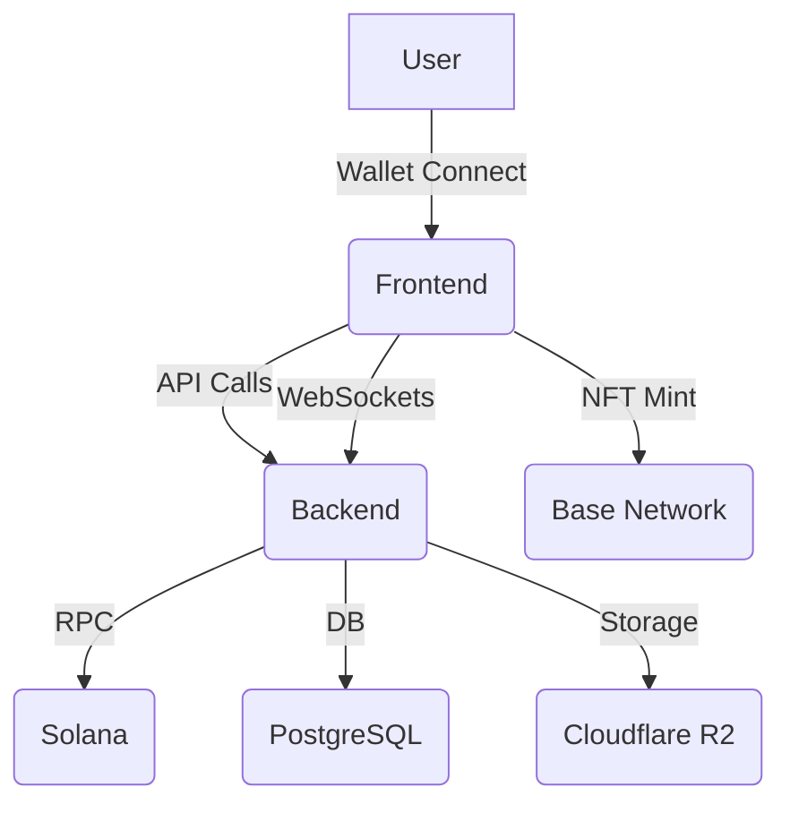
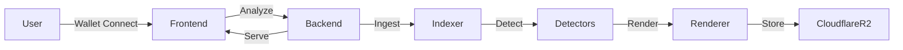

# OOFSOL Platform

---

<div align="center">
  
  <h1>OOFSOL: The Regret Economy Platform</h1>
  <p><b>Analyze, Visualize, and Monetize Crypto Trading Moments</b></p>
  
  
  
  
</div>

---

## 🌟 Vision

OOFSOL is pioneering the world's first <b>Regret Economy</b>—transforming trading mistakes into viral, monetizable art and actionable insights. By combining advanced AI, real-time analytics, and cross-chain NFT monetization, OOFSOL empowers traders, communities, and projects to turn financial pain into opportunity.

---

## 🏗️ Architecture Overview



---

## 🚀 Features Breakdown

### 🔍 Wallet Analyzer
- Deep psychological profiling of trading behavior
- Regret quantification algorithms
- Emotional DNA sequencing
- B2B data licensing for exchanges and marketers

### 🎭 OOF Moments Engine
- Multi-agent AI orchestration (Scout, Director, Artist, Publisher)
- Real-time detection of trading mistakes (S2E, BHD, BadRoute, Idle)
- Viral card rendering (SVG→PNG)
- Shareable, monetizable moments

### 📈 Campaigns & Social Growth
- Community-driven viral campaigns
- Token project integration marketplace
- Mathematical virality optimization
- Achievements, leaderboards, gamified UX

### 🌉 Cross-Chain Monetization
- Solana regret → Base NFT pipeline
- Zora integration for NFT minting
- Automated asset bridging

### 🧠 AI Innovations
- Emotional intelligence as a service
- Infinite viral content factory
- AI-powered campaign optimization

---

## 🛠️ Tech Stack

| Layer      | Technology                                    |
|------------|-----------------------------------------------|
| Frontend   | React, Vite, TypeScript, Tailwind CSS, shadcn/ui, TanStack Query, Wouter |
| Backend    | Rust, Axum, PostgreSQL, Redis, Cloudflare R2, Railway.com, JWT/Dynamic.xyz |
| AI Agents  | Multi-agent orchestration (custom)            |
| Blockchain | Solana, Helius RPC, Jupiter API, Base, Zora   |
| DevOps     | Docker, Railway, Makefile, .env config        |

---

## 📦 Project Structure

```
OOFSOL/
├── Backend/
│   ├── crates/
│   │   ├── shared/
│   │   ├── api/
│   │   ├── indexer/
│   │   ├── workers/
│   │   ├── detectors/
│   │   ├── renderer/
│   │   └── anchor_sdk/
│   ├── configs/
│   ├── db/
│   ├── deploy/
│   ├── infra/
│   ├── scripts/
│   └── tests/
├── Frontend/
│   ├── client/
│   │   ├── src/
│   │   │   ├── components/
│   │   │   ├── pages/
│   │   │   ├── services/
│   │   │   ├── hooks/
│   │   │   └── lib/
│   ├── server/
│   ├── shared/
│   ├── migrations/
│   ├── docs/
│   └── public/
├── README.md
├── codebase.md
└── ...
```

---

## ⚡ Quick Start

### Backend Setup
1. Copy `.env.example` to `.env` and fill in:
   - `DATABASE_URL`, `RPC_PRIMARY`, `ASSET_BUCKET`, `CDN_BASE`
2. Run migrations and seed:
   ```bash
   make migrate && make seed
   ```
3. Start services:
   ```bash
   make run-indexer
   make run-workers
   make run-api
   ```
4. Webhooks: Point Helius to `POST /webhooks/helius` on the indexer

### Frontend Setup
1. Copy `.env.example` to `.env` and configure keys
2. Install dependencies:
   ```bash
   npm install
   ```
3. Start dev server:
   ```bash
   npm run dev
   ```

---

## 🔗 API Reference

### Analyze Wallets
```
POST /v1/analyze
{
  wallets: ["<pubkey>"]
}
```

### Stream Moments
```
GET /v1/stream/moments
```

### Render Card
```
GET /v1/cards/moment/<id>.png
```

---

## 🛡️ Security & Production Readiness
- JWT required for sensitive endpoints
- Daily quotas and rate limits
- HMAC service authentication
- Redis caching, health monitoring
- Cloudflare R2 for scalable storage
- Railway.com for deployment

---

## 🎨 UI/UX Highlights
- Responsive, mobile-first design
- PWA support for installable experience
- Error boundaries, loading skeletons
- Achievements, leaderboards, interactive feedback
- Real-time updates via WebSockets

---

## 🧩 Example: AI Orchestration (Frontend)
```typescript
interface AIAgentOrchestra {
  scout: WalletAnalysisAgent;
  director: StoryGenerationAgent;
  artist: VisualDesignAgent;
  publisher: CrossChainAgent;
}

const orchestrator = new AIOrchestrator({
  scout: new WalletAnalysisAgent(),
  director: new StoryGenerationAgent(),
  artist: new VisualDesignAgent(),
  publisher: new CrossChainAgent()
});
```

---

## 📊 Data Flow Diagrams



---

## 🏆 MVPs & Roadmap
- OOF Moments Engine
- Wallet Analyzer
- Campaigns Engine
- Token Marketplace
- Real-time Social Engagement
- NFT Minting & Monetization
- Cross-chain Asset Bridging
- Gamified Trading Education

---

## 💡 Strategic Innovations
- Emotional intelligence as a service
- Infinite viral content factory
- Regret monetization pipeline
- B2B data licensing
- AI-powered campaign optimization
- Gamified trading education

---

## 👥 Authors & Contributors
- Abelhubprog (Lead)
- See individual crate and frontend docs for details

---

## 📄 License
MIT

---

## ❓ FAQ

**Q: What is an OOF Moment?**
A: An OOF Moment is a perfectly timed trading mistake, detected and visualized by OOFSOL's AI engine.

**Q: How do I connect my wallet?**
A: Use the Connect Wallet button on the frontend. Supported: Solana, Base, and more.

**Q: Can I mint my OOF Moments as NFTs?**
A: Yes! Use the NFT minting feature to bridge your moments to Base and mint via Zora.

**Q: Is my data secure?**
A: Yes. All sensitive endpoints require JWT authentication, and data is encrypted at rest.

**Q: How do I contribute?**
A: Fork the repo, open a PR, and see CONTRIBUTING.md for guidelines.

---

## 📬 Contact & Support
- [GitHub Issues](https://github.com/Abelhubprog/OOFS/issues)
- [Discord](https://discord.gg/oofsol)
- [Twitter](https://twitter.com/oofsol)

---

<!-- End of README. For full codebase deep dive, see codebase.md -->
